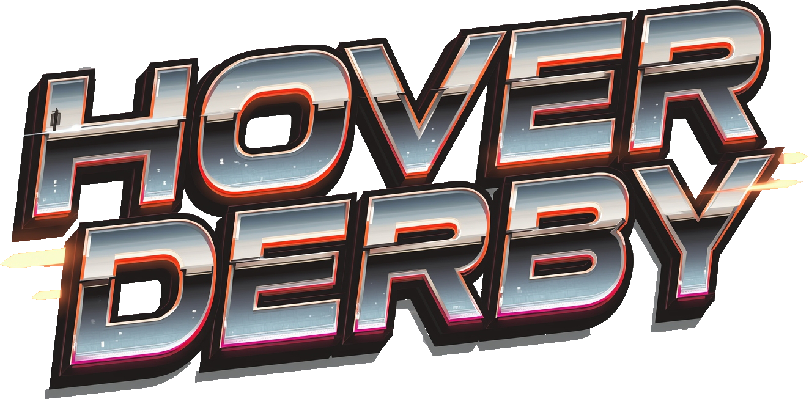

# HoverCar Derby

Unity multiplayer arena prototype exploring Netcode for GameObjects (NGO), Unity Gaming Services (Relay, Lobbies), and client/server authority tradeoffs in a demolition-derby style hover car game.



## Purpose

This prototype focuses on **network architecture and session flow**, not polished gameplay or visuals. It covers host/join sessions, ownership and spawning, match state, and a deliberate hybrid authority model.

Built with Unity 2022.3 LTS and C#. Assets are placeholders or AI-generated for non-commercial use.

## What it demonstrates

- Host and client session setup via **Relay join codes** (supported demo path)
- Player spawning and ownership patterns with Netcode for GameObjects
- Match state machine: cinematic intro, countdown, play, pause, race end
- Server-authoritative combat and scoring with client-authoritative movement
- UGS Auth and Relay integration; `NetworkSession` facade over host/client singletons
- VContainer DI scopes, EventBus hooks, presenter/view UI on main menu and play HUD

Partial UGS paths (lobby browse, matchmaking, dedicated server) exist in code but are not exposed in the menu UI or documented as demo features. See [known limitations](docs/known-limitations.md).

## Screenshots


## Tech stack

Unity 2022.3 LTS | C# | Netcode for GameObjects | UGS Auth | Relay | Lobbies | VContainer | Cinemachine | Input System

Matchmaker and Multiplay stubs remain in the codebase for exploration; they are not part of the supported demo.

## Architecture at a glance

```
Boot (NetBootstrap)
  -> Network bootstrap (client auth or dedicated server arena load)
  -> Session facade (StartHost, JoinByCode, Leave)
  -> Match state machine
  -> Gameplay (hover forces, collision scoring, event bus)
```

| Concern | Authority |
|---------|-----------|
| Movement | Owning client (responsive driving; cheat surface documented) |
| Damage / scoring / collectibles | Server |
| Match phases / timer | Server |

Full writeups: [architecture](docs/architecture.md) · [authority model](docs/authority.md) · [known limitations](docs/known-limitations.md)

## Getting started

1. Clone the repository.
2. Open the project in **Unity 2022.3 LTS** (tested on 2022.3.62f3).
3. Link a Unity Gaming Services project and enable Authentication, Relay, and Lobby.
4. Run two instances (editor + build, or two editor clones via ParrelSync).
5. Host on one instance, join by code on the other.

Do not commit dashboard secrets or account-specific service config.

### How to run

1. **Host:** Wait for the main menu, click **Start Host**. A short join code appears in the notification panel.
2. **Join:** On the second instance, enter that code and join. An empty join code shows a warning; a code is required.
3. **Play:** Intro and countdown run, then drive and ram. Highest score when the timer ends wins.
4. **Leave:** Use the pause or end-of-round menu to return to the main menu.

The supported demo path is **Host + Relay + join code** only.

## Documentation

- [Architecture](docs/architecture.md) — scenes, folder map, session facade, key systems
- [Authority model](docs/authority.md) — who owns movement, damage, score, and match state
- [Known limitations](docs/known-limitations.md) — demo scope, partial UGS paths, production gaps

## Asset credits

- Environment / prop placeholders: **RPGPP_LT** (third-party pack)
- Impact VFX: **Cartoon FX Remaster** by Jean Moreno (Unity Asset Store terms)
- Custom / AI-generated UI and title art under `Assets/Limekicker/Art`

Third-party assets remain under their own licenses. They are not covered by the MIT grant below.

## License

Original project code and documentation: [MIT](LICENSE).

Third-party packages and Asset Store content keep their respective licenses (see Asset Store EULA for Cartoon FX Remaster and the RPGPP_LT pack terms).
