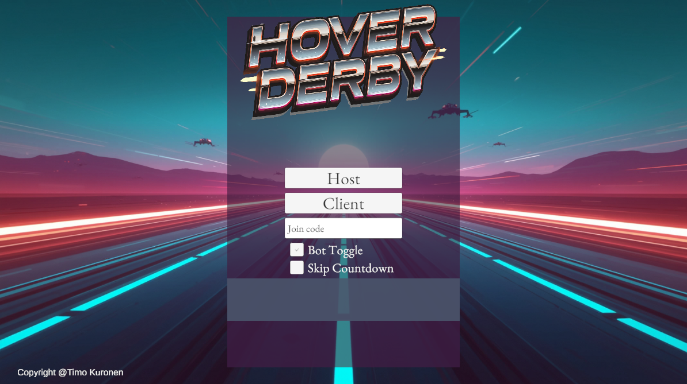
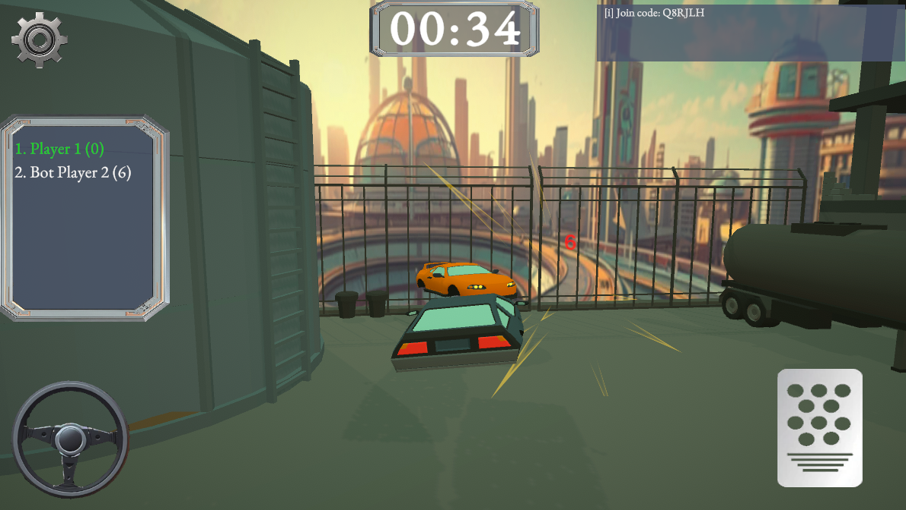

# HoverCar Derby

[](ProjectSettings/ProjectVersion.txt)
[](LICENSE)

Unity multiplayer arena prototype exploring Netcode for GameObjects (NGO), Unity Gaming Services (Auth, Relay), and client/server authority tradeoffs in a demolition-derby style hover car game.





## Highlights

- Host and client session setup via Relay join codes
- Player spawning and ownership patterns with Netcode for GameObjects
- Match state machine: cinematic intro, countdown, play, pause, race end
- Hybrid authority: client-owned movement, server-owned combat and scoring
- UGS Auth and Relay behind a `NetworkSession` facade
- VContainer DI scopes, EventBus hooks, presenter/view UI on main menu and play HUD

Demo path: **Host + Relay + join code**.

## Architecture

```text
Boot (NetBootstrap)
  -> Network bootstrap (client auth or dedicated server arena load)
  -> Session facade (StartHost, JoinByCode, Leave)
  -> Match state machine
  -> Gameplay (hover forces, collision scoring, event bus)
```

| Concern | Authority |
|---------|-----------|
| Movement | Owning client |
| Damage / scoring / collectibles | Server |
| Match phases / timer | Server |

Details: [architecture](docs/architecture.md) · [authority model](docs/authority.md)

## Stack

| Area | Choice |
|------|--------|
| Engine | Unity `2022.3.62f3` LTS |
| Networking | Netcode for GameObjects |
| Services | UGS Auth, Relay, Lobbies |
| DI | VContainer |
| Other | Cinemachine, Input System |

## Docs

- [Architecture](docs/architecture.md)
- [Authority model](docs/authority.md)

## Asset credits

- Environment / prop pack: **RPGPP_LT**
- Impact VFX: **Cartoon FX Remaster** by Jean Moreno
- Custom / AI-generated UI and title art under `Assets/Limekicker/Art`

Third-party assets remain under their own licenses. They are not covered by the MIT grant below.

## License

Original project code and documentation: [MIT](LICENSE).

Third-party packages and Asset Store content keep their respective licenses (see Asset Store EULA for Cartoon FX Remaster and the RPGPP_LT pack terms).