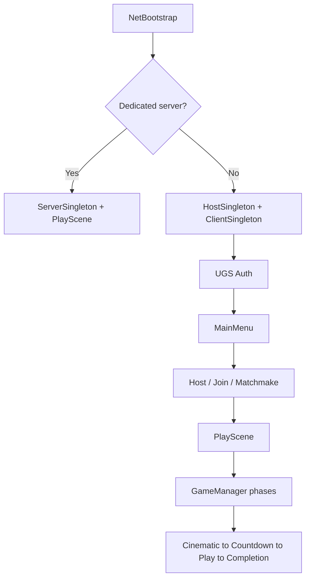

# Architecture

HoverCar Derby is a Unity 2022.3 LTS demolition-derby prototype focused on **Netcode for GameObjects (NGO)** and **Unity Gaming Services** (Auth, Relay, Lobbies, Matchmaker stubs). Gameplay and visuals are intentionally minimal so networking and session design stay front and center.

## Folder map

```
Assets/Limekicker/
├── Scenes/                 NetBootstrap, MainMenu, PlayScene, Bootstrap
├── Prefabs/                Cars, NetworkManager, HUD, collectibles
├── Scripts/
│   ├── Networking/         Connection, host/client/server, UGS services
│   ├── Managers/           GameManager, spawn, score, audio, input
│   ├── Player/             Movement, controller, bots
│   ├── Car/                Car lifecycle, colors
│   ├── DamageSystem/       Collisions, health, VFX
│   ├── Collectibles/       Pickups and spawner
│   ├── GameStates/         Cinematic, countdown, play, completion
│   ├── EventBus/           Decoupled local events
│   ├── DI/                 VContainer lifetime scopes
│   ├── UI/                 Menus, presenters, views, lobby, notifications
│   ├── Audio/              Cues, preferences
│   ├── Cameras/            Cinemachine, dolly intros
│   └── ScriptableObjects/  IntVariable and shared SO patterns
├── Scriptables/            Timer/countdown assets, audio cues
└── DefaultNetworkPrefabs.asset
```

Art and VFX under `Assets/JMO Assets` and `Assets/RPGPP_LT` are placeholders.

## Scenes

| Scene | Role |
|-------|------|
| `NetBootstrap` | App entry; creates singletons; auth; routes to menu or dedicated server |
| `Bootstrap` | Optional name entry |
| `MainMenu` | Host and join by code (MVP UI); lobby browse and Find Match hidden — see limitations doc |
| `PlayScene` | Arena, GameManager, match loop |

## Runtime flow



## Naming: session managers vs match GameManager

| Name | Role |
|------|------|
| `GameManager` (PlayScene) | Match/race state machine; server-authoritative phases |
| `ClientGameManager` | Client session: Relay join, matchmaker, disconnect |
| `HostGameManager` | Host session: Relay alloc, lobby create, StartHost |
| `ServerGameManager` | Dedicated server / Multiplay path |
| `NetworkSession` | Facade — UI should call this, not singletons |

## NetworkSession facade

UI and gameplay call `NetworkSession` instead of Host/Client/Server singletons directly.

| Method | Purpose |
|--------|---------|
| `StartHostAsync()` | Relay + Lobby + StartHost |
| `StartClientViaJoinCodeAsync(code)` | Join Relay session |
| `FindMatchAsync(callback)` | Matchmaker (dedicated path) |
| `LeaveGame()` / `ReturnToMainMenu()` | Host shutdown or client disconnect → MainMenu |
| `RestartCurrentMatch()` | Reload PlayScene for rematch (host NGO / client local) |
| `QueryAvailableLobbiesAsync()` | Lobby browser |
| `JoinLobbyByIdAsync(id)` | Browse → join code → connect |

Singletons (`HostSingleton`, `ClientSingleton`, `ServerSingleton`) are DontDestroyOnLoad and created at NetBootstrap.

## PlayScene menu MVP

| Menu | View | Presenter |
|------|------|-----------|
| Pause (resume, leave, open/close) | `PauseMenuView` | `PauseMenuPresenter` |
| Round results | `RoundResultsView` | `RoundResultsPresenter` |
| Live scoreboard | `ScoreDisplayView` | `ScoreDisplayPresenter` |

Composition root: `GameUiPresenterBootstrap` (registered in `GameLifetimeScope`). Pause opens via on-screen pause button; resume via resume button or pause toggle. Leave calls `NetworkSession.ReturnToMainMenu()`. SFX/music toggles on the pause panel are plain UI for now (not wired). Session actions go through `NetworkSession` only.

## MainMenu MVP

| Concern | View | Presenter |
|---------|------|-----------|
| Host / join by code | `MainMenuView` | `MainMenuPresenter` |

Composition root: `MenuUiPresenterBootstrap` (registered in `MenuLifetimeScope`). Find Match and lobby browse UI are hidden; session calls go through `NetworkSession` only.

## Key systems

| Question | Start here |
|----------|------------|
| Host / join | `MainMenuView` / `MainMenuPresenter` → `NetworkSession` → Host/Client game managers |
| Player spawn | `PlayerSpawnManager` |
| Round start/end | `GameManager` + `MatchTimerDisplaySync` + `GameStates/*` |
| Pause | `MatchPauseController` via `IGameManager.TogglePause` |
| Damage | `ServerPhysicsCollisionHandler` |
| Score | `ScoreManager` + `DamageDealtEvent` |
| PlayScene menus | `GameUiPresenterBootstrap`, pause / round-results presenters |
| Session leave / rematch | `NetworkSession.ReturnToMainMenu` / `RestartCurrentMatch` |
| Player notifications | `SessionNotifications` + `NotificationConsoleView` |
| Debug log panel | `RuntimeConsoleView` |

## Prefabs (high level)

| Prefab | Purpose |
|--------|---------|
| `NetworkManager` | NGO + Unity Transport |
| `Networking/HostManager` | Host singleton wiring |
| `Networking/ClientManager` | Client singleton wiring |
| `Hover Car_Player Variant` | Networked player car |
| `GameManager` | Match flow (NetworkBehaviour) |
| `GameUiCanvas` | HUD, pause/settings/results, scoreboard; `GameplayHudPresenter` toggles driving HUD by match state |
| `Prefabs/UI/RuntimeConsolePanel` | Error/exception log UI |
| `Prefabs/UI/NotificationConsolePanel` | Player-facing session messages |

## Primary demo path

**Host + Relay + join code** (2–4 players) is the only supported demo path. Lobby browse and Find Match remain in code for future work but are not exposed in the menu UI.

Related: [authority.md](authority.md)