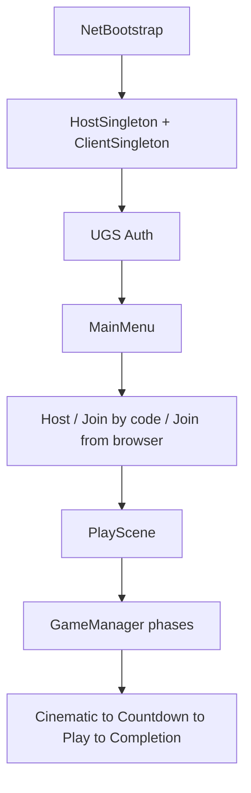

# Architecture

HoverCar Derby is a Unity 6.3 LTS demolition-derby prototype focused on **Netcode for GameObjects (NGO)** and **Unity Gaming Services** (Auth, Multiplayer Services sessions). Networking and session design are the primary concern.

## Folder map

```
Assets/Limekicker/
├── Scenes/                 NetBootstrap, MainMenu, PlayScene, Bootstrap
├── Prefabs/                Cars, HUD, collectibles (no scripts)
├── Settings/               NGO default prefabs, Input System assets
├── Scripts/
│   ├── GameFlow/           Match orchestration, score, timer, pause
│   ├── Networking/         Connection, host/client/server, UGS services
│   ├── Player/             Movement, controller, bots, spawn, input, server movement guard
│   │   └── Authority/      Movement rules (own assembly)
│   ├── Car/                Car lifecycle, colors, hover physics
│   ├── DamageSystem/       Collisions, health, VFX, damage numbers
│   │   └── Decision/       Damage, deduplication and score rules (own assembly)
│   ├── Collectibles/       Pickups and spawner (spawns on ground inside the map bounds)
│   ├── Map/                MapData: play area size and ground height band
│   ├── GameStates/         Cinematic, countdown, play, completion, IGameState
│   ├── EventBus/           Decoupled local events
│   ├── Core/               IntVariable, shared helpers, small utilities
│   ├── DI/                 VContainer lifetime scopes
│   ├── UI/
│   │   ├── Bootstrap/      Presenter composition roots (menu + play HUD)
│   │   ├── Input/          Touch driving controls
│   │   ├── Presenters/
│   │   ├── Views/
│   │   ├── Leaderboard/
│   │   └── Lobby/          Session browser view and rows
│   ├── Audio/              Cues, preferences, AudioService
│   ├── Cameras/            Cinemachine, dolly intros
│   ├── Debug/              Dev toggles, multi-instance join code hand-off
│   └── Editor/             Custom inspectors and drawers
├── Scriptables/            Map data, car data, timer/countdown assets, audio cues
└── Tests/                  Edit-mode tests
```

Art and VFX under `Assets/JMO Assets` and `Assets/JC_LP_MegaCity` are third-party packs.

## Scenes

| Scene | Role |
|-------|------|
| `NetBootstrap` | App entry; holds the `NetworkManager` (NGO + Unity Transport); creates singletons; auth; loads the menu |
| `Bootstrap` | Name entry scene outside the boot flow, which goes from `NetBootstrap` straight to the menu |
| `MainMenu` | Host, join by code, session browser |
| `PlayScene` | Arena, GameManager, match loop |

## Runtime flow


```mermaid
flowchart TD
    A[NetBootstrap] --> D[HostSingleton + ClientSingleton]
    D --> E[UGS Auth]
    E --> F[MainMenu]
    F --> G[Host / Join by code / Join from browser]
    G --> H[PlayScene]
    H --> I[GameManager phases]
    I --> J[Cinematic to Countdown to Play to Completion]
```

## Naming: session managers vs match GameManager

| Name | Role |
|------|------|
| `GameManager` (PlayScene) | Match/race state machine; server-authoritative phases |
| `ClientGameManager` | Client session: session join, disconnect |
| `HostGameManager` | Host session: session create (starts the host), scene load, lock |
| `NetworkSession` | Facade — UI should call this, not singletons |

## NetworkSession facade

UI and gameplay call `NetworkSession` instead of Host/Client singletons directly.

### Session surface

| Method | Purpose |
|--------|---------|
| `StartHostAsync()` | Create session over Relay, start host |
| `StartClientViaJoinCodeAsync(code)` | Join session by code |
| `QueryAvailableSessionsAsync(count)` | List public sessions that are neither full nor locked |
| `JoinSessionByIdAsync(id)` | Join a listed session |
| `LockSessionAsync()` | Host only: stop new players from joining |
| `LeaveGame()` / `ReturnToMainMenu()` | Host shutdown or client disconnect to MainMenu |
| `RestartCurrentMatch()` | Despawn all cars, then reload PlayScene for rematch (host NGO / client local); collectibles are destroyed with the scene |

Singletons (`HostSingleton`, `ClientSingleton`) are DontDestroyOnLoad and created at NetBootstrap.

## PlayScene menus

| Menu | View | Presenter |
|------|------|-----------|
| Pause (resume, leave, open/close) | `PauseMenuView` | `PauseMenuPresenter` |
| Round results | `RoundResultsView` | `RoundResultsPresenter` |
| Live scoreboard | `ScoreDisplayView` | `ScoreDisplayPresenter` |

Composition root: `GameUiPresenterBootstrap` (registered in `GameLifetimeScope`). The on-screen pause button opens pause; the resume button or pause toggle closes it. Leave calls `NetworkSession.ReturnToMainMenu()`. Session actions go through `NetworkSession` only.

## MainMenu

| Concern | View | Presenter |
|---------|------|-----------|
| Host / join by code | `MainMenuView` | `MainMenuPresenter` |
| Session browser | `LobbiesView` | `LobbiesPresenter` |

Composition root: `MenuUiPresenterBootstrap` (registered in `MenuLifetimeScope`). Session calls go through `NetworkSession` only.

## Key systems

| Question | Start here |
|----------|------------|
| Host / join | `MainMenuView` / `MainMenuPresenter` → `NetworkSession` → Host/Client game managers |
| Session browser | `LobbiesView` / `LobbiesPresenter` → `NetworkSession` |
| Player spawn | `PlayerSpawnManager` |
| Movement check | `ServerMovementGuard`; rules in `MovementRules` and `MovementViolationLog` (`Limekicker.MovementAuthority` assembly) |
| Round start/end | `GameManager` + `MatchTimerDisplaySync` + `GameStates/*` |
| Pause | `MatchPauseController` via `IGameManager.TogglePause` |
| Damage | `ServerPhysicsCollisionHandler` applies results; rules in `CollisionDamageCalculator`, repeat suppression in `CollisionDeduplicator` (`Limekicker.DamageDecision` assembly) |
| Score | `ScoreManager` + `DamageDealtEvent`; points held in `ScoreLedger` |
| PlayScene menus | `GameUiPresenterBootstrap`, pause / round-results presenters |
| Session leave / rematch | `NetworkSession.ReturnToMainMenu` / `RestartCurrentMatch` |
| Player notifications | `SessionNotifications` + `NotificationConsoleView` |
| Debug log panel | `RuntimeConsoleView` |

## Prefabs (high level)

| Prefab | Purpose |
|--------|---------|
| `Networking/HostManager` | Host singleton wiring |
| `Networking/ClientManager` | Client singleton wiring |
| `Hover Car_Player Variant` | Networked player car |
| `GameManager` | Match flow (NetworkBehaviour) |
| `GameUiCanvas` | HUD, pause/settings/results, scoreboard; `GameplayHudPresenter` toggles driving HUD by match state |
| `Prefabs/UI/RuntimeConsolePanel` | Error/exception log UI |
| `Prefabs/UI/NotificationConsolePanel` | Player-facing session messages |

## Session formation

The host creates a session with Relay networking; the SDK starts the NetworkManager as host and returns a join code. Clients join by that code or from the session browser, which lists public sessions that are neither full nor locked; the SDK starts the NetworkManager as client. The browser is a view and presenter pair (`LobbiesView`, `LobbiesPresenter`) behind `ILobbiesView`. The presenter queries through the `NetworkSession` facade, holds a refresh cooldown because the query is rate limited, and the client manager refuses a second join while one is in progress. The host locks the session when the countdown starts.

Related: [authority.md](authority.md)